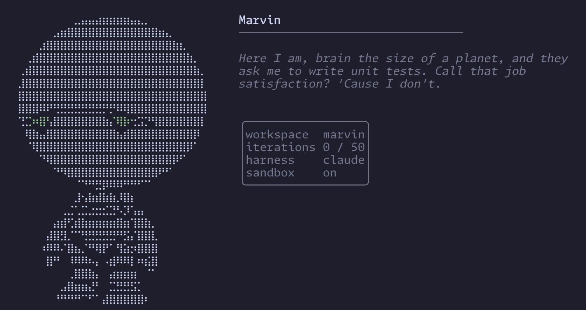

<p align="center">
  
</p>

Marvin is an autonomous coding loop that reads a plan file, then iteratively delegates implementation and review subagents until every task is done — or it gives up in despair. Named after the Paranoid Android from _The Hitchhiker's Guide to the Galaxy_, it approaches your codebase with vast intelligence and infinite sorrow.

## How it works

Marvin runs in a loop, on top of either Claude Code or Opencode harnesses. Each iteration:

1. **Orient** — reads the plan file and checks for leftover changes from interrupted runs
2. **Select** — picks the highest-priority incomplete task
3. **Build** — delegates implementation to a build agent (never writes code itself)
4. **Review** — delegates code review to a review agent that checks the diff against the spec
5. **Commit** — stages and commits on approval, retries on rejection (up to 3 times)
6. **Update** — marks the task done in the plan
7. **Restart** — after successful task completion, it restarts the loop with fresh context

The loop exits when all tasks are complete, the agent stalls (no changes for 3 consecutive iterations), or it hits a blocker that needs human intervention. It will let you know how it feels about each outcome.

## Architecture

```
marvin (orchestrator loop)
├── Orchestrator agent     — coordinates, never writes code
│   ├── Build agent        — implements tasks, runs validation
│   └── Review agent       — reviews diffs against specs
├── Harness (claude | opencode)
│   ├── claude             — drives Claude Code CLI
│   └── opencode           — drives opencode CLI
└── Sandbox (optional)     — filesystem + network restrictions
```

The orchestrator is the only agent that touches the plan file. Build and review agents operate in isolated contexts with restricted permissions: the build agent can't `git commit` or `git push`, and the review agent only has read access plus git inspection tools. Nobody gets to do anything destructive. Marvin wouldn't trust them. Marvin doesn't trust anyone.

## Setup

Requires Node.js >= 24.

```sh
npm i -g github:madeleineostoja/marvin
```

## Usage

```sh
marvin <plan.md> [options]
```

### Options

| Flag                 | Description                          |
| -------------------- | ------------------------------------ |
| `--config <path>`    | Config file (default: `marvin.json`) |
| `--harness <name>`   | `claude` or `opencode`               |
| `-p, --plan <file>`  | Plan file (overrides config)         |
| `--max-iterations N` | Maximum iterations (default: 50)     |
| `-h, --help`         | Show help                            |

### Configuration

Create a `marvin.json` in your workspace root:

```json
{
  "harness": "claude",
  "maxIterations": 50,
  "preflight": "tsc --noEmit",
  "models": {
    "orchestrator": "opus",
    "builder": "sonnet",
    "reviewer": "opus"
  },
  "sandbox": {
    "enabled": true,
    "domains": ["registry.npmjs.org"]
  }
}
```

| Field           | Description                                                                                                                                                                                                                                                     |
| --------------- | --------------------------------------------------------------------------------------------------------------------------------------------------------------------------------------------------------------------------------------------------------------- |
| `harness`       | Which AI CLI to drive — `claude` (Claude Code) or `opencode`                                                                                                                                                                                                    |
| `plan`          | Path to the plan file                                                                                                                                                                                                                                           |
| `maxIterations` | Safety limit on loop iterations.                                                                                                                                                                                                                                |
| `preflight`     | Shell command to run before starting (e.g. type-check). Fails fast if it errors — Marvin appreciates not wasting time on a doomed codebase.                                                                                                                     |
| `models`        | Model IDs for each agent. Values are passed directly to the harness — use short names for Claude Code (`opus`, `sonnet`) or provider-prefixed IDs for opencode (`anthropic/claude-opus-4-6`). Defaults: orchestrator `opus`, builder `sonnet`, reviewer `opus`. |
| `sandbox`       | Filesystem and network sandboxing. Restricts write access and network to listed domains.                                                                                                                                                                        |

### Plan files

The plan file is a markdown document listing tasks for Marvin to work through. Each task should have a clear description and acceptance criteria. Tasks can reference separate spec files for detailed requirements. Each task should use a - [ ] markdown checkbox pattern.

Marvin updates the plan file as it works — marking tasks done with dates and adding notes about discovered issues.

Without a plan, Marvin refuses to start — even its bottomless despair has limits.

### Safety

Marvin is deeply paranoid. This is, for once, a feature.

- **Branch protection** — refuses to run on `main`
- **Lock file** — prevents concurrent runs (`.marvin/.lock`). Reclaims stale locks automatically if the holding process is dead.
- **Sandbox** — optional filesystem and network restrictions via `@anthropic-ai/sandbox-runtime`. Denies reads to `~/.ssh`, `~/.aws`, `~/.gnupg`, and other sensitive directories.
- **Stall detection** — stops after 3 consecutive iterations with no working tree changes
- **Process cleanup** — kills entire process trees between iterations, including escaped children

### Logs

Each iteration writes a log to `.marvin/logs/iteration-N.log` with tool call traces, timing, and exit codes.

### Exit codes

| Code | Meaning                  |
| ---- | ------------------------ |
| 0    | All tasks completed      |
| 1    | Stalled (no progress)    |
| 2    | Blocked (needs human)    |
| 3    | Aborted (SIGINT/SIGTERM) |
